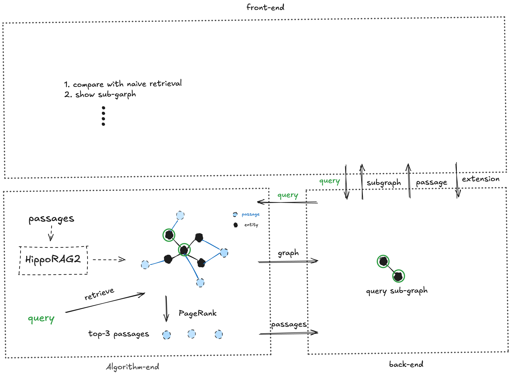

# HippoRe2News
This project is based on Graph RAG—HippoRAG2 to implement news retrieval functionality. The backend is built with FastAPI, and the frontend uses Vue 3 for visualization, comparison, and graph operations.

